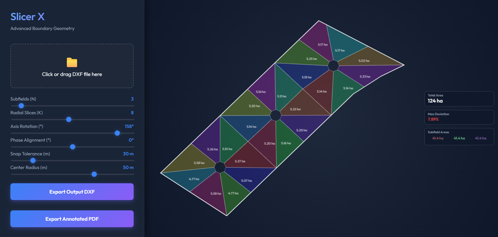

# Field Slicer

This repository contains a tool for partitioning irregular polygons into equal-area subfields and radial slices. It serves as a "vibe-coding" experiment, where the entire codebase was generated through the orchestration of AI agents. This process demonstrated a positive workflow for building complex geometric tools without manual code modification, though it highlighted limitations in handling intricate topological edge cases that required multiple iterative steps to resolve.

## Project Architecture

The application is split into a high-performance geometric core and a responsive web interface.

### Geometric Core (Rust/WASM)
The logic core is located in the `core-wasm` directory and is compiled to WebAssembly for browser execution.

- The `execute_slicing` function (defined in `lib.rs`) coordinates the slicing process by parsing inputs into internal structs and calling the underlying algorithms.
- Boundary extraction is performed by the `parse_dxf_boundary` function in `lib.rs`, which uses methods in `dxf_util.rs` to process raw bytes from uploaded CAD files.
- The `slice` function (located in `slicing.rs`) implements the partition logic, calculating how to divide a polygon based on the number of subfields and radial cuts requested.
- Polygon data structures and serialization logic are defined in `geometry.rs`, ensuring consistent coordinate systems between Rust and TypeScript.

### Frontend (TypeScript/Vite)
The user interface is managed by the code in the `frontend` directory.

- Initialization is handled by the `setupLogic` function in `slicerLogic.ts`, which sets up event listeners for file uploads and slider interactions.
- The `updateSlices` function in `slicerLogic.ts` captures user input from the UI sliders and triggers the WASM core for new calculations.
- Vizualization logic is contained within the `draw` function in `slicerLogic.ts`, which handles canvas scaling, polygon rendering, and real-time area labeling.
- Exporting results to PDF is managed by the `generatePDF` function in `slicerLogic.ts`, which uses `jspdf` to create annotated reports with field dimensions.

## Getting Started

1. **Build the Core**: Navigate to `core-wasm` and use `wasm-pack build --target web` to compile the Rust logic.
2. **Run the App**: Navigate to `frontend`, run `npm install`, and then `npm run dev` to start the local development server.

The project uses a dark-themed aesthetic with the 'Outfit' typeface and dynamic canvas rendering to provide a modern experience for geometric data analysis.

## Next Steps

1. As of now, the DXF exporter has not been tested.
2. The PDF schematic could be improved.